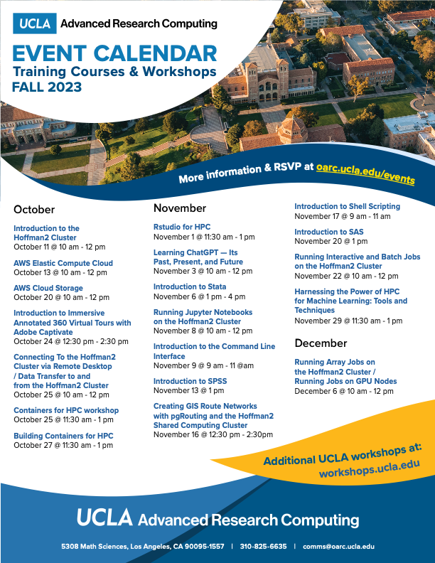

## Announcement

* HW1 due this Friday 11:59pm on Gradescope/BruinLearn.

* Instructor OH: Tue 12pm-1pm (CHS 21-254A), Thu 2pm-3pm (Zoom).

* TA OH: Wed 5pm-6pm (TBD), Fri 2pm-3pm (Zoom).

* IDRE Workshops.

## Today

* Vectors (BV Chapters 1-3).

* Matrices (BV Chapters 6-10).
